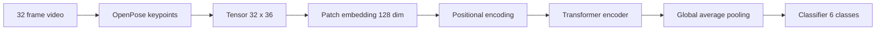
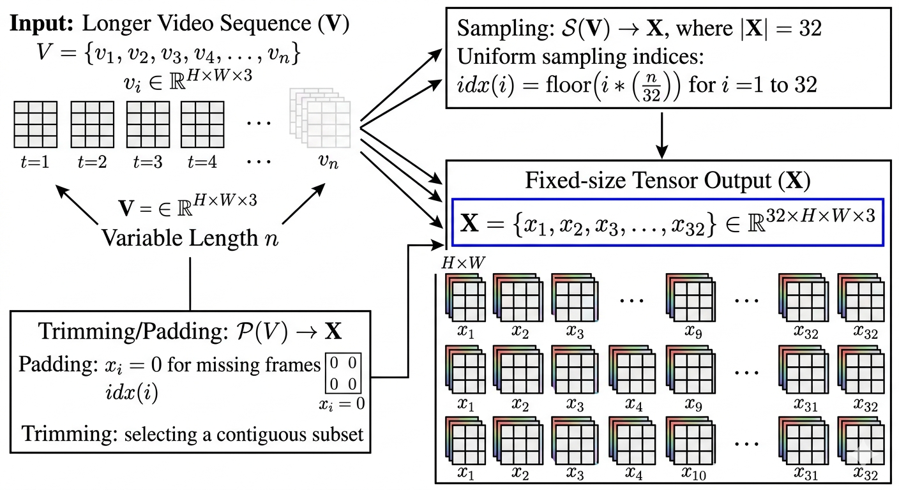
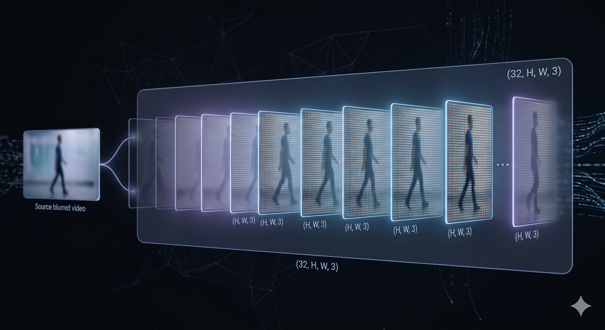
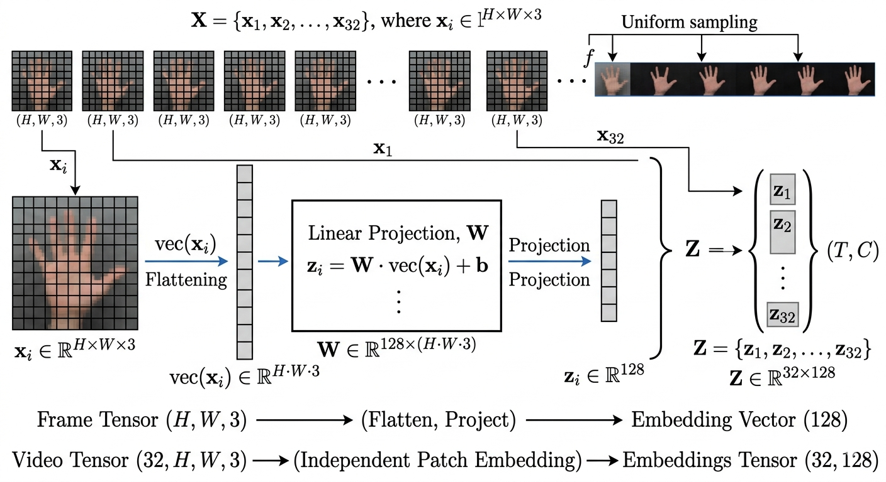
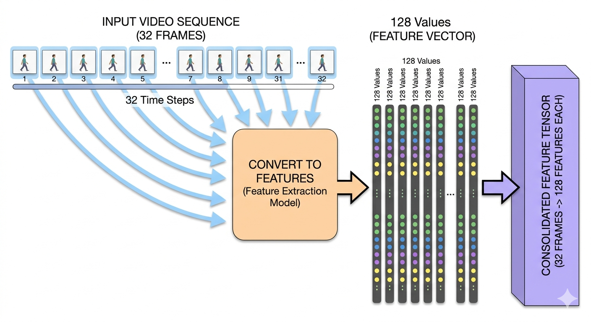
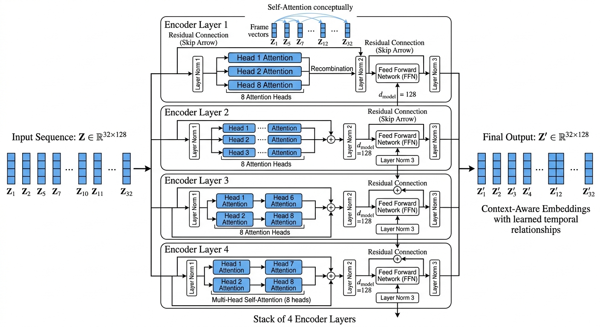
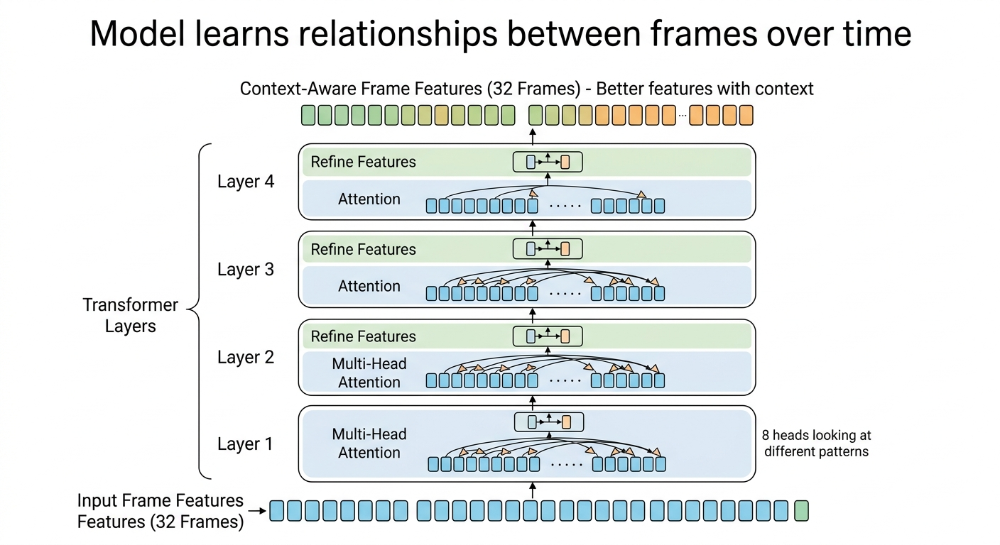
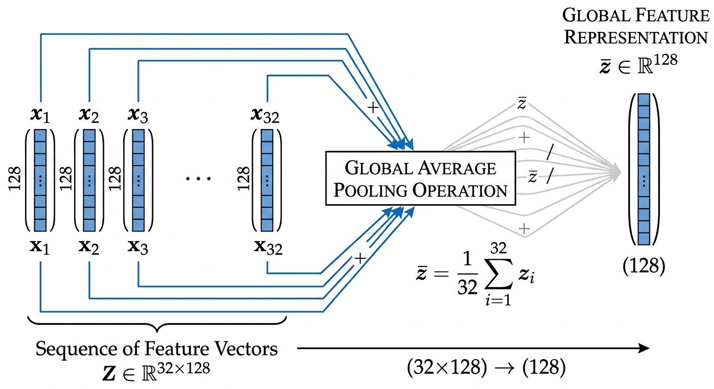
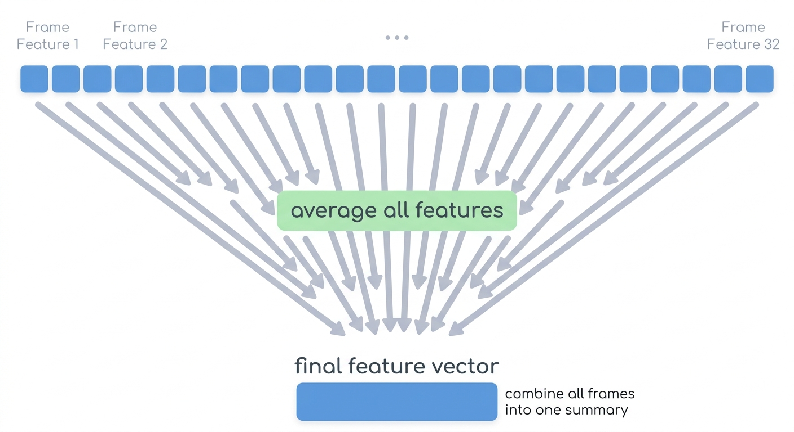
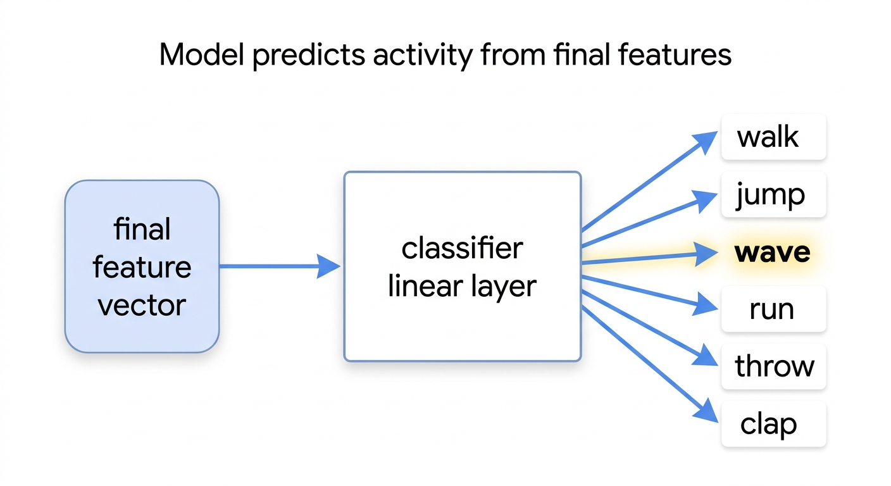

# ActionSnap


```                                                                                         
▄████▄  ▄▄▄▄ ▄▄▄▄▄▄ ▄▄  ▄▄▄  ▄▄  ▄▄ ▄█████ ▄▄  ▄▄  ▄▄▄  ▄▄▄▄  
██▄▄██ ██▀▀▀   ██   ██ ██▀██ ███▄██ ▀▀▀▄▄▄ ███▄██ ██▀██ ██▄█▀ 
██  ██ ▀████   ██   ██ ▀███▀ ██ ▀██ █████▀ ██ ▀██ ██▀██ ██    
```

</p>

<p align="center">


</p>


## ⚙️ Flow Overview




## video ingestion 





## Patch Embedding





## positional encoding


## Transformer Encoder






## Global Pooling




## CLASSIFIER HEAD


