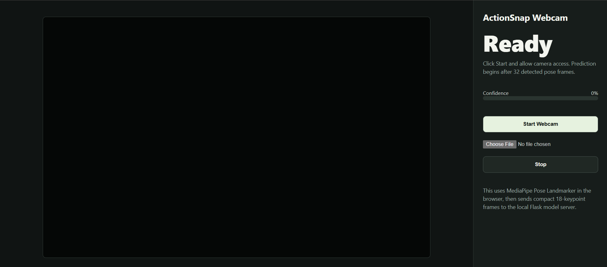

# ActionSnap

<p align="center">

```text
▄████▄  ▄▄▄▄▄ ▄▄▄▄▄▄ ▄▄  ▄▄▄  ▄▄  ▄▄ ▄█████ ▄▄  ▄▄  ▄▄▄  ▄▄▄▄
██▄▄██ ██▀▀▀   ██   ██ ██▀██ ███▄██ ▀▀▀▄▄▄ ███▄██ ██▀██ ██▄█▀
██  ██ ▀████   ██   ██ ▀███▀ ██ ▀██ █████▀ ██ ▀██ ██▀██ ██
```

</p>

<p align="center">


</p>

ActionSnap is a human action recognition project that classifies 2D pose sequences with a Transformer model. It supports:

- Transformer training on the RNN-HAR-2D-Pose dataset
- Live webcam prediction in a local browser interface
- Local video upload prediction in the same web interface
- Six action classes: `JUMPING`, `JUMPING_JACKS`, `BOXING`, `WAVING_2HANDS`, `WAVING_1HAND`, `CLAPPING_HANDS`

## Current Result

The trained Transformer checkpoint reached:

```text
Test accuracy: 0.9903
Best checkpoint: lightning_logs/version_8/checkpoints/transformer-epoch=44-val_loss=0.0242.ckpt
App checkpoint: models/saved_model.ckpt
```

## Web Interface

The working local interface is served by `webcam_app.py`.

It includes both:

- **Start Webcam** for instant webcam prediction
- **Video upload** for checking a local video file

### Screenshots




### Demo Videos

Uploaded-video workflow:

<video src="video.mp4" controls width="720"></video>

Working webcam workflow:

<video src="working_webcam.mp4" controls width="720"></video>

If your Markdown viewer does not render videos inline, open these files directly:

- [video.mp4](video.mp4)
- [working_webcam.mp4](working_webcam.mp4)

## How It Works


The browser extracts pose landmarks with MediaPipe. The Flask server receives compact 36-feature pose frames, buffers 32 frames, and sends the sequence to the trained Transformer checkpoint.

## Architecture Images

Video Ingestion

<p align="center">
  
  
</p>

Patch Embedding

<p align="center">
  
  
</p>

Positional Encoding

<p align="center">
  
  
</p>

Transformer Encoder

<p align="center">
  
  
</p>

Global Average Pooling

<p align="center">
  
  
</p>

Classifier Head

<p align="center">
  
</p>

## Project Files

```text
transformer.py                  Transformer model + data module
transformer_train.ipynb         Training notebook
transformer_deploy_ngrok.ipynb  Local deployment notebook walkthrough
webcam_app.py                   Working webcam + video upload interface
models/saved_model.ckpt         Trained checkpoint used by the web app
content/RNN-HAR-2D-Pose-database Dataset folder
ss1.png                         Web interface screenshot
ss2.png                         Prediction interface screenshot
video.mp4                       Uploaded-video demo
working_webcam.mp4              Webcam demo
```

## Setup

Use the environment that has the project dependencies installed. On this machine, the working Python executable is:

```powershell
D:\AI_WORK\ai_env\python.exe
```

Install the main dependencies if needed:

```powershell
python -m pip install torch torchvision pytorch-lightning flask mediapipe opencv-python numpy scikit-learn
```

## Training Walkthrough

1. Open `transformer_train.ipynb`.

2. Run the dataset setup cells. The dataset should exist at:

   ```text
   content/RNN-HAR-2D-Pose-database
   ```

3. Confirm the config cell uses:

   ```python
   DATASET_PATH = "content/RNN-HAR-2D-Pose-database"
   ```

4. Run the model/data module cells.

5. Run the training cell:

   ```python
   trainer.fit(model, data_module)
   ```

6. Copy the best checkpoint to the app checkpoint path:

   ```text
   models/saved_model.ckpt
   ```

7. Run the evaluation cell. The current trained model reports about:

   ```text
   Test accuracy: 0.9903
   ```

## Local Web App Walkthrough

Start the interface:

```powershell
D:\AI_WORK\ai_env\python.exe webcam_app.py
```

Open:

```text
http://127.0.0.1:5000/
```

Use `Ctrl + F5` after code changes so the browser reloads the latest JavaScript.

### Webcam Mode

1. Click **Start Webcam**.
2. Allow camera permission.
3. Stand far enough back for your upper body and arms to be visible.
4. Wait for the app to collect 32 pose frames.
5. Perform one of the trained actions.
6. The predicted action and confidence appear on the right panel.

### Video Upload Mode

1. Click the file picker under **Start Webcam**.
2. Choose a local video file.
3. The video plays in the interface.
4. Pose frames are extracted from the video.
5. After 32 pose frames, predictions update while the video runs.

### Stop the Server

Find the current server process ID from PowerShell:

```powershell
Get-NetTCPConnection -LocalPort 5000 -State Listen
```

Then stop it:

```powershell
Stop-Process -Id <PID>
```

## Notes

- The web app uses MediaPipe in the browser, so the first run needs internet access to download the pose landmarker assets.
- The model was trained only on six action classes. If you sit still, it may still choose one of those six classes because `IDLE` was intentionally removed.
- For best predictions, keep one person visible, avoid extreme camera angles, and keep arms inside the frame.
